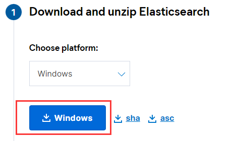

* [官方地址](https://www.elastic.co/cn)
* [下载页](https://www.elastic.co/cn/downloads/elasticsearch)
# 1.安装与运行
## 1.1 jdk说明
### 1.1.1 jdk对应关系
* ES 7.x 及之前版本，选择 Java 8
* ES 8.x 及之后版本，选择 Java 17 或者 Java 18，建议 Java 17，因为对应版本的 Logstash 不支持 Java 18
* Java 9、Java 10、Java 12 和 Java 13 均为短期版本，不推荐使用
* M1（Arm） 系列 Mac 用户建议选择 ES 7.8.x 以上版本，因为考虑到 ELK 不同产品自身兼容性，7.8.x以上版本原生支持 Arm 原生 JDK
### 1.1.2 运行时的jdk选择
Elasticsearch默认安装包带有jdk环境，如果系统配置JAVA_HOME，那么使用系统默认的JDK，如果没有配置使用自带的JDK，一般建议使用系统配置的JDK。
## 1.2 运行说明
运行成功ES服务后，ES服务会占用两个端口，9300和9200，9300是用于组件通信的端口，9200为RestFul服务端口，用户使用9200，注意该端口是RestFul不是WebUI。
## 1.2.1 windows安装
选择windows版本点击下载，解压后运行bin目录下的.\elasticsearch.bat即可运行服务

# 2.目录结构
```text
drwxr-xr-x 1 71979 197609       0 Mar 19 10:18 bin/  
# 配置
drwxr-xr-x 1 71979 197609       0 Mar 19 10:18 config/
# 内置的java环境一般来说不用这个自带的jdk，不过需要注意自己的jdk能否运行该版本的ES
drwxr-xr-x 1 71979 197609       0 Mar 19 10:18 jdk/
# ES自身运行相关jar包
drwxr-xr-x 1 71979 197609       0 Mar 19 10:18 lib/
drwxr-xr-x 1 71979 197609       0 Feb 13 09:36 logs/
# 别的功能模块（kibana），也是各类jar包集合，
drwxr-xr-x 1 71979 197609       0 Mar 19 10:18 modules/
drwxr-xr-x 1 71979 197609       0 Feb 13 09:36 plugins/
```
